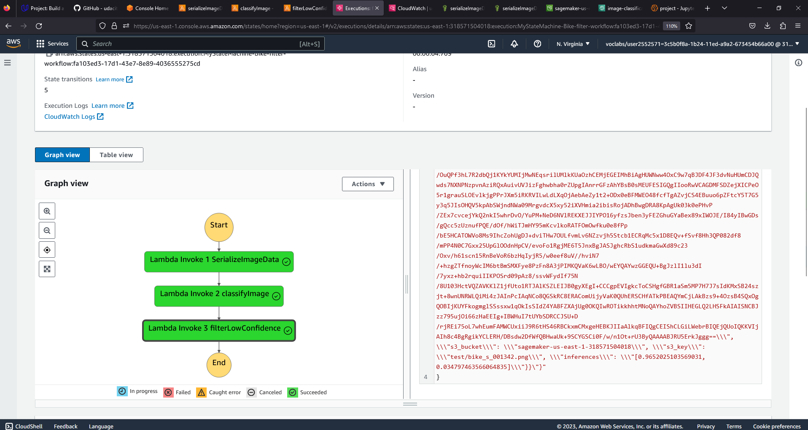
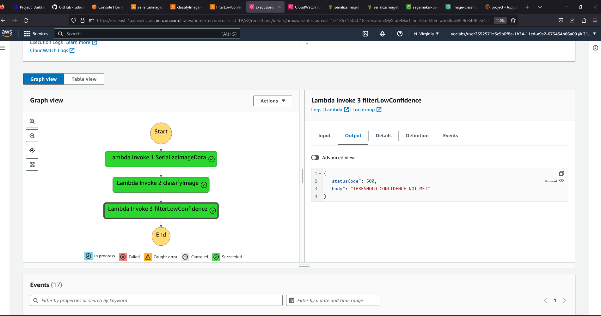

# ML-workflow-Scones-Unlimited-On-Amazon-SageMaker 🍰

> **This project is a part of the assessment in Udacity's AWS Machine Learning Engineer Nanodegree Program.**

## 🌟 Project Overview
An AWS Sagemaker-based Image Classification model for **Scones Unlimited**, a scone-delivery logistics company. The model distinguishes between bicycles 🚲 and motorcycles 🏍️ to optimize delivery routing. Features event-driven architecture with AWS Lambda and Step Functions, ensuring scalability and performance monitoring.

---

## 📋 Project Steps Overview

1. **Data Staging**: Prepare and stage your data for training.
2. **Model Training and Deployment**: Train your image classification model and deploy it.
3. **Lambdas and Step Function Workflow**: Set up AWS Lambda functions and Step Functions to automate the workflow.
4. **Testing and Evaluation**: Evaluate the model's performance and make necessary adjustments.
5. **Optional Challenge**: Extend the project with additional features or optimizations.
6. **Cleanup Cloud Resources**: Remove any temporary or unnecessary cloud resources.

---
## Step Function / State Machine | Confidence Threshold Met

## Step Function / State Machine | Confidence Threshold Not Met

---
